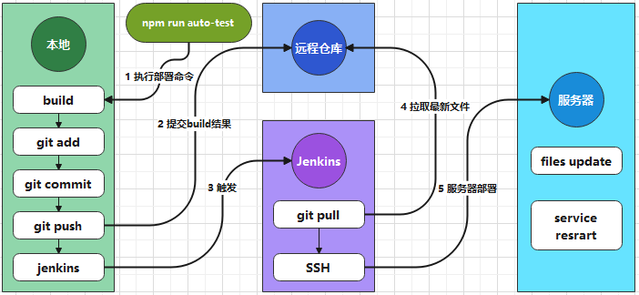

# 线上密码管理网站

## 1. 工程介绍

* 基于 Nxut 实现的“在线密码管理工具”前端工程
* **详细使用请见** [**操作手册**](https://gitee.com/jingenqiang/password-online-web/blob/master/options.md)

```shell
# 项目介绍
git clone git@github.com:enqiangjing/password-online.git

# 后端项目
git clone git@github.com:enqiangjing/password-online-api.git
```


## 2. 软件架构

### 2.1 服务能力


### 2.2 自动化部署




## 3. 安装教程

### 3.1 获取

``` shell
git clone git@github.com:enqiangjing/password-online-web.git
cd password-online-web
npm install
npm install --global pm2
```

### 3.2 操作

* **应用 gulp 集成打包、git提交、Jenkins 构建**。详见 gulpfile.js文件；
* **开发时命令**：
* npm run dev --- 本地开发环境；
* npm run build --- 开发环境 build；
* npm run build-test --- 测试环境（本地虚拟机） build；
* npm run build-production --- 生产环境（阿里云服务器） build；
* npm run start --- build 后启动
* **部署时命令**：
* npm run auto-test --- 测试环境一键部署（gulp 集成命令）；
* npm run auto-production --- 生产环境一键部署（gulp 集成命令）。


## 版本信息

### 最新版本

> * 测试版 v1.0.0
>    - 修改部分内容展示
>    - 变更密钥文件加载方式
>    - 登录超时后，自动重新登录

### 版本历史

> * 预览版 v0.0.1
> 	- 初始功能可用
>	- 前后端分离


## * 免责声明

* 本项目所有内容仅供参考和学习交流使用。
* 项目所存在的风险将由使用者自行承担，因使用本项目而产生的一切后果也由使用者自己承担。
* 凡以任何方式直接、间接使用本项目的人员，视为自愿接受本项目声明和法律法规的约束。