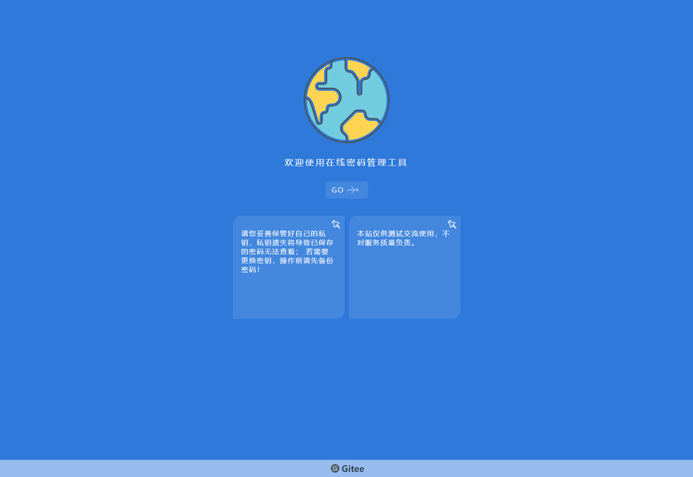
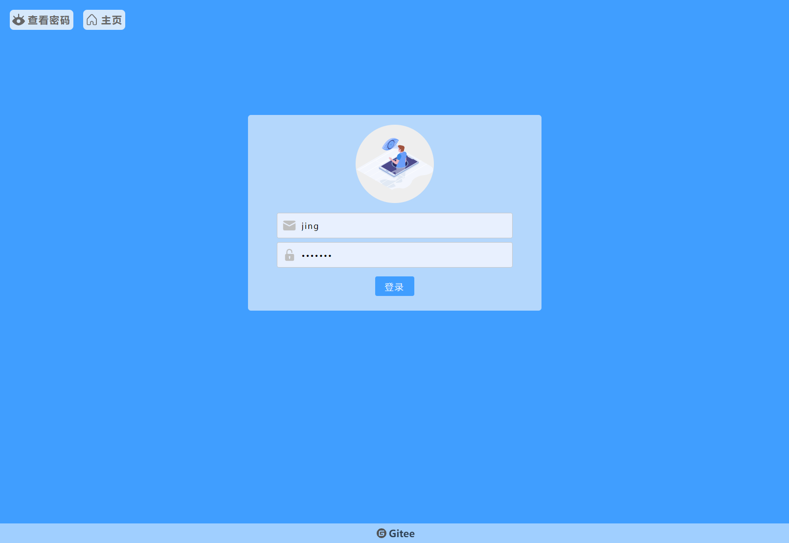
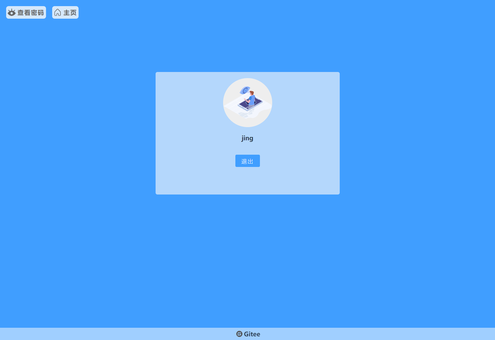
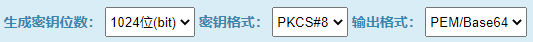
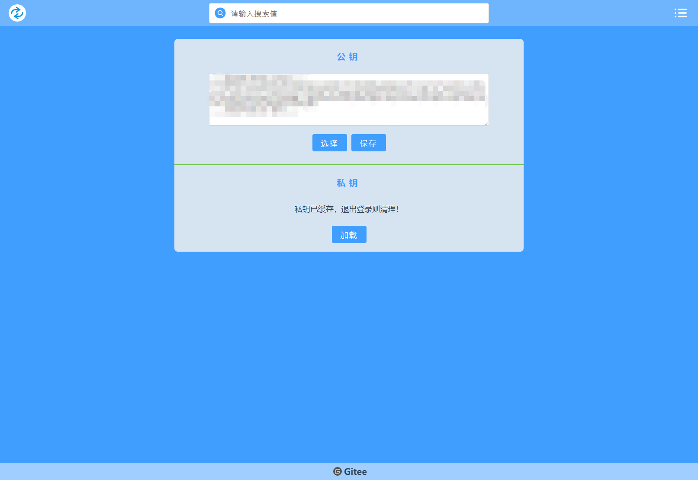
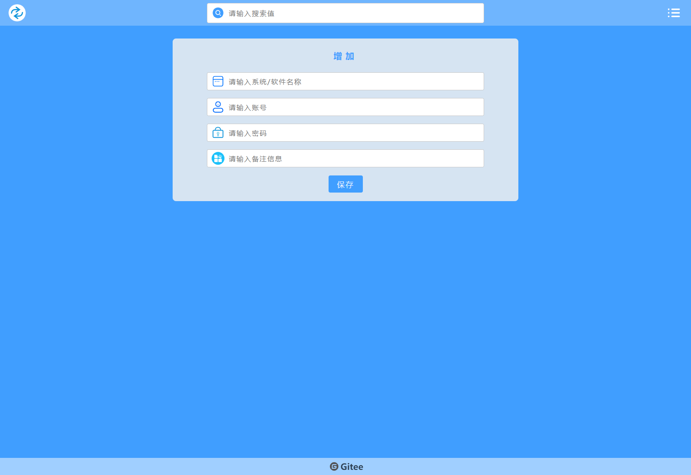
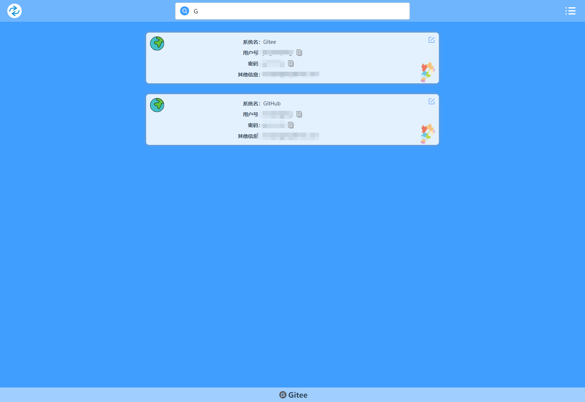

# 操作手册

## 首页

* 点击“go”按钮进入登录页面

## 登录

* 输入用户名及密码登录
* 点击“查看密码”按钮进入密码查看页面
* 点击“主页”按钮进入首页

## 密钥

* 若未加载公钥和私钥，登录后会自动跳转到该页面
* 选择公钥（必做），保存（可选）---将公钥保存到服务器
* 加载私钥（必做）
* 公钥、私钥加载后，均缓存在浏览器 local storage，可通过“退出”操作清除
* 可使用搜索引擎搜索rsa密钥生成工具，或使用 ./about/data/ 下提供的测试数据

* > 密钥生成方式：  
     > 

## 账号信息增加/修改

* 经公钥加密后发送到密码中心

## 账号查看

* 从密码中心获取账号列表，经本地私钥解密后展示
* 搜索功能为本地搜索

